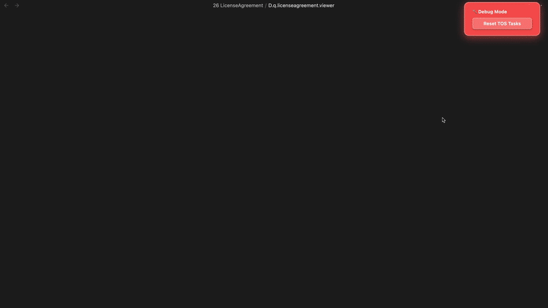

  
  
  <h1 align="center">LICENSE AGREEMENT</h1>
  <h3 align="center"> Modal Gatekeeper & Terms Enforcer </h3>

  <!-- TOP PURPLE LINKS -->
  
  
  
   
  <!-- BOTTOM GOLD TAXONOMY -->
  
  
  
  

  

    <i> A robust and secure modal gatekeeper that dynamically enforces Terms of Service by aggressively blocking input until a localized markdown checklist is completed. </i>
  

  

Welcome to **License Agreement**, a secure modal component designed to lock down the interface and enforce explicit user consent. By hooking directly into the Obsidian input loop, it ensures all terms are checked and recorded straight back into your vault files securely.

---

## ✨ Features

### 🛡️ Aggressive Input Blocking
*   🚫 **Global Command Interception**: Patches core Obsidian functions to aggressively disable the command palette and application-wide hotkeys while the modal is active.
*   🔒 **Keyboard Hook Trap**: Actively intercepts system keystrokes (`Cmd+W`, `Ctrl+O`) internally to prevent the user from navigating away before completing the tasks.
*   🧊 **Full View Blur**: Applies an un-dismissible, blurred overlay to the entire workspace if any tasks are left unchecked.

### 📝 Live Task Management
*   📂 **Bidirectional Markdown Sync**: Reads task lists directly from your target file (e.g. `TERMS OF SERVICE.approval.md`), and checking a box instantly writes an `[x]` back to the local file.
*   🔄 **Reactive Re-Verification**: If a user agrees to the terms but later manually unchecks a task in the background, the gatekeeper automatically re-activates immediately.
*   💻 **Integrated Iframe Rendering**: Safely sandboxes an external website or Terms page in a web view so users can scroll and read without losing focus.

---

## 📦 Directory Index & Components

The package exposes the following compiled files:

| File | Description |
| :--- | :--- |
| **[LICENSE AGREEMENT.md](LICENSE%20AGREEMENT.md)** | The main entry point leaf designed to be loaded inside Obsidian panes. |
| **[src/index.jsx](src/index.jsx)** | Main bootstrap application loader and polling invalidation daemon. |
| **[src/App.jsx](src/App.jsx)** | Core gatekeeper, blocking logic, and DOM traversal. |
| **[data/mcp_commands.json](data/mcp_commands.json)** | Local polling payload for HMR invalidation. |
| **[METADATA.md](METADATA.md)** | Packaging manifest outlining indexing, target, and security configurations. |
| **[CONTRIBUTION.md](CONTRIBUTION.md)** | Contributor architecture standards and local compilation guidelines. |
| **[LICENSE.md](LICENSE.md)** | MIT open-source license. |
